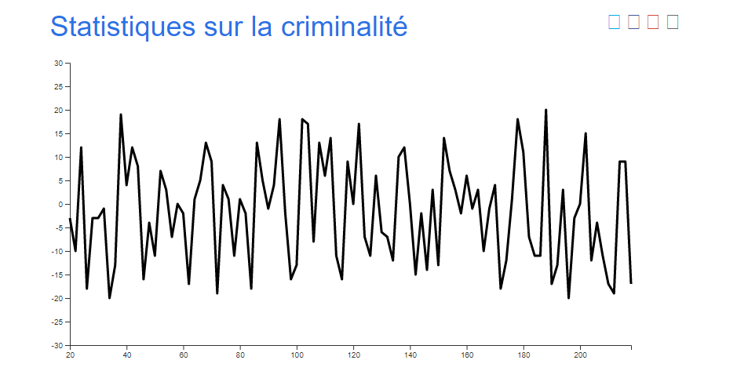
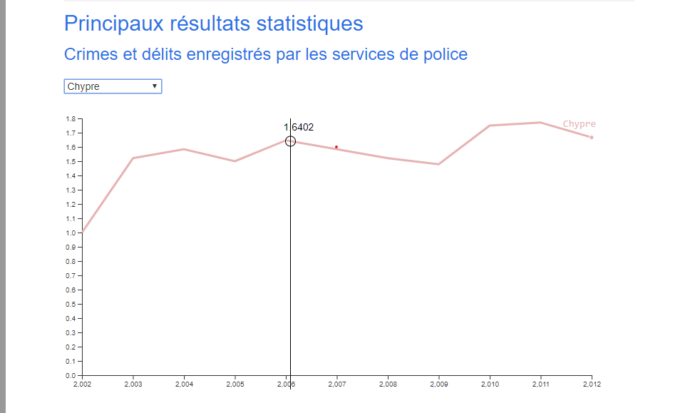
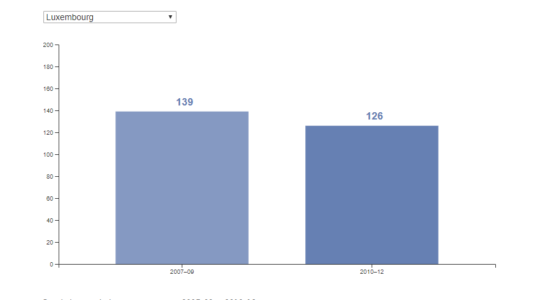

# js-datavisualisation-challenge

[js-datavisualisation-challenge](https://levizar.github.io/js-datavisualisation-challenge/)

## Goal

The goals of this project were to:

1. Get the data in the HTML
2. Select consistent chart according to the data displayed
3. Make 3 differents charts:
   - For 2 of these charts, it must have a possibility to filter the data by country
   - For the first chart, Ajax has to be used to fetch the data needed

## Technologies

- D3.js
- Javascript

## Team:

[**Brice Bartoletti**](https://github.com/Levizar)

This project was a solo challenge.

Special thanks to my [Woods team-mates](https://github.com/orgs/becodeorg/teams/crl-woods-2-15) from BeCode for helping.
Especially:

- [**Kevin Labtani**](https://github.com/kevin-labtani) for the tutos he found and shared.
- [**Denis Bourgeois**](https://github.com/Debourgeo) for his time spent talking with me about it.

## Comments:

I encountered several difficulties in this project:

- We had one week to learn the library and make something nice out of it for this project.
  We didn't praticed D3.JS before and thus it was kind of a very intense work to achieve the goals.

- There is a lot of documentation about D3.JS on the web but most of it is outdated.
  It results in code that works in D3 v4 but not in D3 v5.

- Modification in the HTML file was forbidden by the instructions.
  Thus, I had to come with a cleaver solution to make a reusable function.

- Making bar charts is newbie-friendly but I wanted to make a line chart and it was and still is way harder.
  Then, I spent a lot of time understanding it and there was nearly no tutorial to learn it.

- The first charts with fetch data was finished in time but was awful.
  I ran out of time thus I came up with the solution of removing and regenerating the charts.
  I thought it was kind of ugly thus I refactored this part 1 month later and I came out with something way nicer.

## Preview:

### First chart : fetch data

### Second chart : Line chart with:
- filter by country 
- line data tracker

### Third chart : Simple bar chart with a data display on hoover

